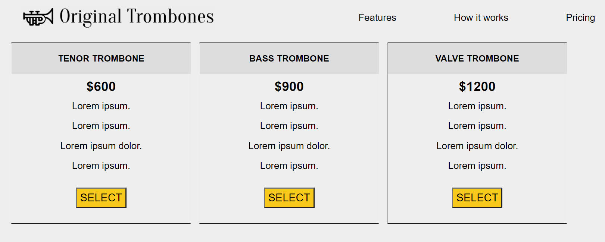

# Free code camp product landing page

This is my solution for the free code camp challenge (link HERE). I tried to be the more accurate possible with all CSS details and the more semantic possible with the HTML tags.

## Built With

-HTML and CSS

## Live Demo

[Live Demo Link](https://luis-pomare.github.io/freeCodeCampProductLandingPage/)

## Authors👤

**Luis pomare**

- GitHub: [@luis-pomare](https://github.com/luis-pomare)
- Twitter: [@LuisPomare1](https://twitter.com/LuisPomare1)
- LinkedIn: [luis-pomare-388116225](https://www.linkedin.com/in/luis-pomare-388116225/)

## Show your support

Give a ⭐️ if you like this project!
